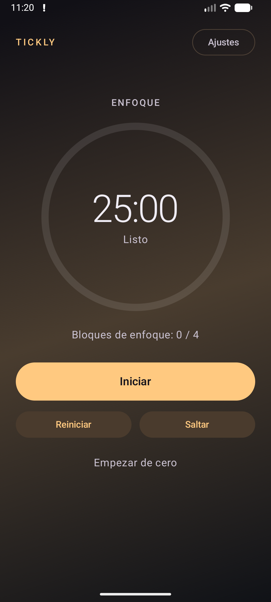
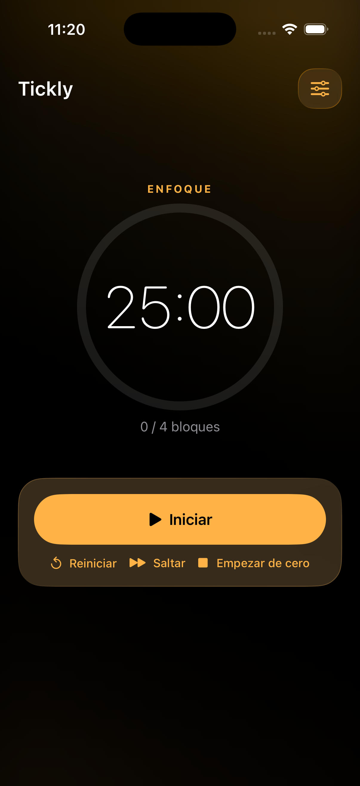
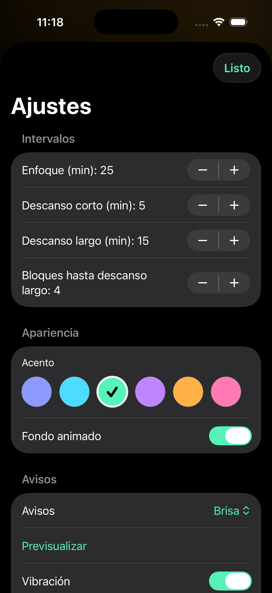

# Tickly

Tickly es un temporizador Pomodoro personal, sereno y premium. Está diseñado para funcionar completamente en local, sin conexión ni cuentas, con intervalos configurables y una experiencia exclusivamente en modo oscuro.

La definición de producto se encuentra en el [diseño de producto](docs/product-design.md), la terminología en el [glosario](CONTEXT.md) y la decisión de arquitectura en el [ADR 0001](docs/adr/0001-platform-native-ui.md).

> La evidencia de compilación, pruebas y smoke tests está en la [validación](docs/validation.md).

## Capturas de pantalla

Un vistazo al temporizador en Android e iOS y a los ajustes de personalización. Pulsa cualquier captura para verla a tamaño completo.

| Temporizador · Android | Temporizador · iOS | Ajustes · iOS |
| :---: | :---: | :---: |
| [](docs/screenshots/android.png) | [](docs/screenshots/ios.png) | [](docs/screenshots/ios-theme-settings.png) |

## Capacidades implementadas

- Temporizador de enfoque, descanso corto y descanso largo.
- Inicio manual de cada intervalo, con pausa, reinicio y salto.
- Duraciones configurables: enfoque de 1 a 180 minutos y descansos de 1 a 60 minutos; descanso largo tras 2 a 8 enfoques completados.
- Valores iniciales: 25 minutos de enfoque, 5 de descanso corto, 15 de descanso largo y un descanso largo cada 4 enfoques.
- Persistencia local del estado para reconstruir un intervalo al volver a abrir la aplicación.
- Personalización local: seis acentos, tres sonidos suaves o silencio, vibración opcional, degradado de fondo animado opcional y opción de mantener la pantalla encendida durante el enfoque.
- Español e inglés, con selección de idioma Sistema / Español / English.
- Accesibilidad: reducción de movimiento y transparencia prioriza la legibilidad sobre los efectos visuales.

No forman parte del alcance inicial las cuentas, sincronización, tareas, estadísticas, rachas, widgets, Live Activities, temporizador persistente en la pantalla bloqueada ni una interfaz específica para tablet.

## Arquitectura y UI

El código se organiza por **slices funcionales** (`timer` y `settings`), con `app` para composición y `core` para diseño/localización compartidos. Consulta el [mapa y reglas de organización](docs/code-organization.md) antes de añadir una funcionalidad.

- `sharedLogic/`: motor del temporizador y reglas compartidas de Kotlin Multiplatform; no contiene UI.
- `sharedUI/`: interfaz Android en Compose, con Material estable compatible con el proyecto.
- `androidApp/`: punto de entrada Android.
- `iosApp/iosApp/`: interfaz y punto de entrada SwiftUI para iOS.

Android utiliza Material mediante el wrapper `1.9.0`, correspondiente a AndroidX `1.4.0`, junto con Compose `1.11.1`. iOS requiere **iOS 26 o posterior** y utiliza SwiftUI con Liquid Glass. Las interfaces son nativas e independientes, mientras que las reglas del temporizador se comparten en `sharedLogic`.

La pantalla principal prioriza una cuenta regresiva grande, progreso circular sutil, avance de bloques y controles claros. El fondo es un degradado orgánico y lento derivado del acento seleccionado, que puede desactivarse y queda estático con reducción de movimiento.

## Avisos, permisos y funcionamiento offline

Tickly opera localmente y offline. Al terminar un intervalo intenta emitir un aviso único y discreto, con sonido y vibración opcionales. Los avisos dependen de permisos y restricciones del sistema: no están garantizados en todos los casos, por ejemplo tras una detención forzada. Si se deniega el permiso, el temporizador sigue siendo utilizable e indicará que los avisos están desactivados.

La aplicación no intentará eludir el silencio ni No molestar. En Android también comunica si no cuenta con el acceso necesario para avisos precisos.

## Desarrollo

Ejecuta los comandos desde la raíz del repositorio:

```bash
# Generar el APK de depuración Android
./gradlew :androidApp:assembleDebug
```

Para compilar y ejecutar iOS, abre [`iosApp/`](iosApp) en Xcode y usa su esquema de ejecución.

## Pruebas

Las pruebas de comportamiento y regresión se realizan exclusivamente con Maestro. Aún no hay flujos Maestro versionados, por lo que no hay una suite de pruebas ejecutable hasta que se añadan. Las fuentes Kotlin de prueba se conservan como evidencia histórica; las compilaciones, lint y análisis estáticos no son evidencia de pruebas.

## Calidad

Las puertas locales y de CI de estilo, análisis estático y compilación están documentadas en [quality gates](docs/quality-gates.md). No ejecutan pruebas; las pruebas del producto se gestionan con Maestro. Para ejecutar los gates:

```bash
scripts/quality-gates.sh
```
