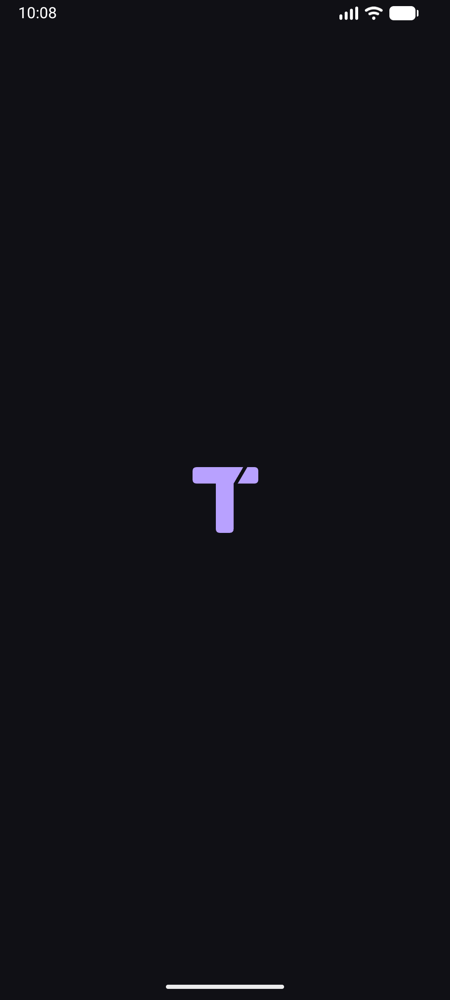
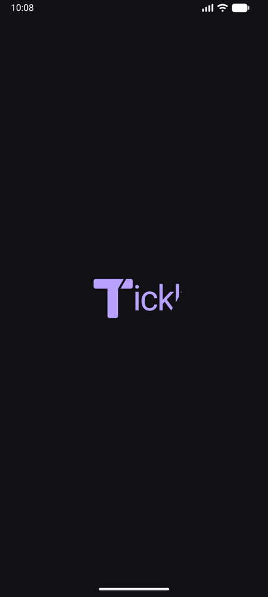
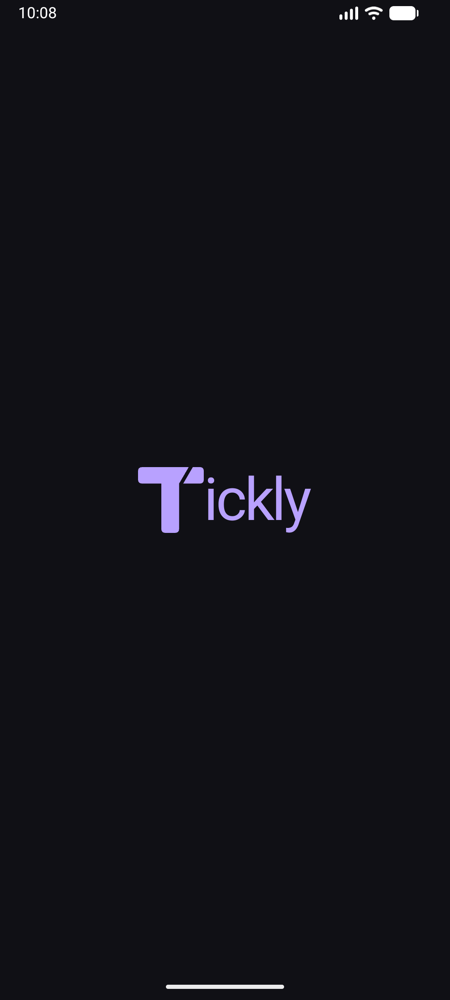
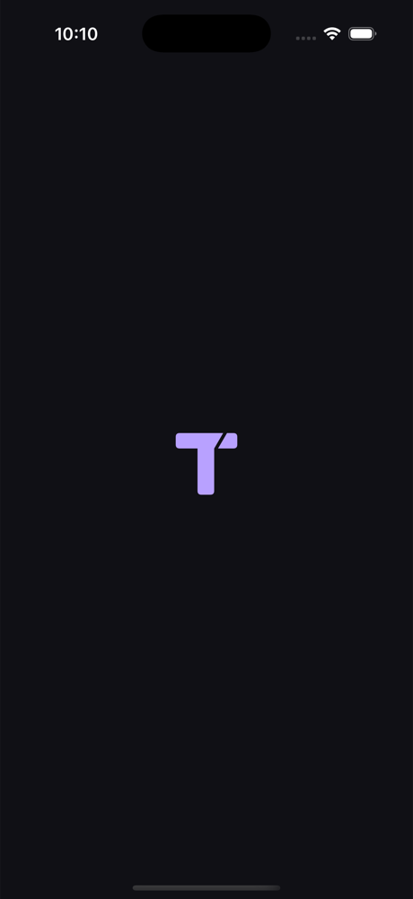
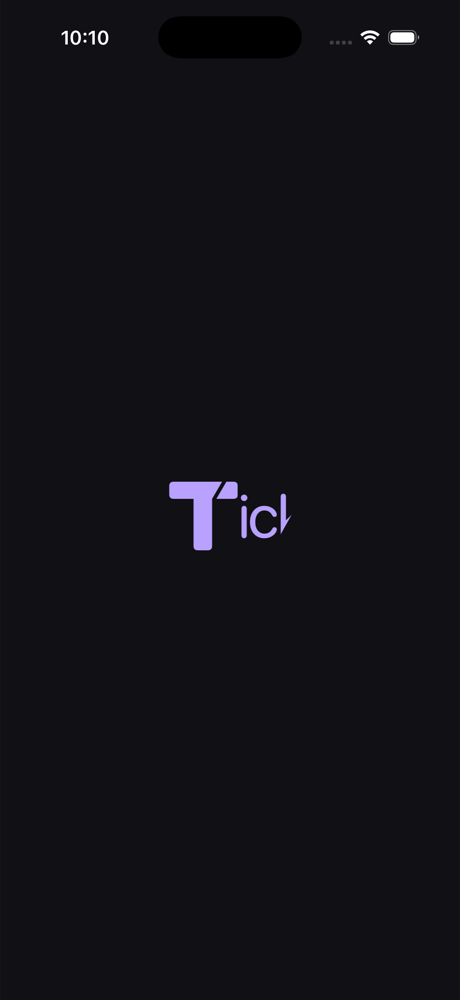
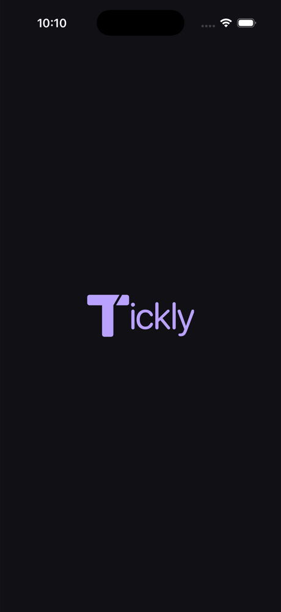

# Tickly · marca y arranque

La T lavanda (`#B8A1FF`) con corte diagonal sobre tinta (`#101015`) conecta el icono con el revelado del nombre. El PNG maestro es `tickly-logo.png`. Las versiones vectoriales de la T en los launchers adaptativos y en el splash mantienen la silueta nítida a cualquier escala.

## Assets

- `docs/brand/tickly-logo.png`: original generado, opaco, sin esquinas exteriores pre-recortadas.
- `androidApp/src/main/res/mipmap-anydpi/ic_launcher*.xml`: iconos legacy vectoriales, con fondos redondeado/circular; evitan PNG duplicados y máscaras incorrectas en Android antiguo.
- `androidApp/src/main/res/drawable-v24/ic_launcher_foreground.xml`: monograma vectorial dentro del área segura adaptativa.
- `iosApp/iosApp/Assets.xcassets/AppIcon.appiconset/tickly-icon.png`: exportación 1024 × 1024 sin canal alfa, válida también con apariencia oscura.

## Movimiento

La intención de la secuencia es T centrada durante 2 s, revelado diagonal y desplazamiento suave durante 800 ms, pausa del nombre completo durante 500 ms y salida de 300 ms. El temporizador sigue montado debajo del splash; no se retrasa su restauración ni coordinación de avisos. Reducir movimiento omite la secuencia. Volver del background no debe repetirla.

El launch screen del sistema es estático, con fondo oscuro. La secuencia de marca se ejecuta en Compose (Android) y SwiftUI (iOS), no en el dominio compartido. No se añade una biblioteca de splash.

Referencias de integración: [Android splash screen theme](https://developer.android.com/develop/ui/views/launch/splash-screen) y [Apple UILaunchScreen](https://developer.apple.com/documentation/bundleresources/information-property-list/uilaunchscreen).

## Generación

Herramienta: `image_gen` integrada; `sips` solo para exportar el tamaño iOS del original y las capturas de documentación, sin redibujar la imagen. Los iconos Android son recursos vectoriales nativos.

Prompt original:

> Create a production app icon for Tickly, a refined focus timer app. Single square 1024x1024 full bleed opaque image. Flat uniform very dark ink background #101015, no rounded outside corners (OS supplies masking). Centered distinctive uppercase T monogram in soft lavender #B8A1FF, occupying 48% of canvas width and height. Geometric modern thick T, gently rounded ends, small precise diagonal slice across the upper right of the top bar giving a subtle time/tick motif. T must remain immediately readable. Restrained elegant minimal vector-like silhouette, exceptionally crisp edges. No other letters, no full word, no clock circle, no mockup, no lighting, no shadows, no texture, no border, no gradients. This asset will be used directly as launcher icon on Android and iOS. Save image to available local file and report its path.

## Comprobación visual

En un arranque en frío, comprobar T → Tickly → temporizador, sin destello blanco ni cortes del nombre. Repetir con reducir movimiento, rotación/tamaño compacto y al regresar del background. Las capturas de la PR documentan los estados; las compilaciones no sustituyen esa comprobación.

### Capturas del simulador

| Plataforma | T inicial | Corte en progreso | Nombre completo |
| --- | --- | --- | --- |
| Android |  |  |  |
| iOS |  |  |  |

## Validación local

- `./scripts/quality-gates.sh all`: estilo Kotlin/Swift, Android Lint, pruebas host, APK debug, tests KMP iOS y compilación iOS de simulador.
- Android Lint: 0 errores y 13 advertencias restantes (APIs/avisos, target, KTX y recursos; no se suprimieron). Iconos temáticos disponibles mediante variantes API 33.
- 41 ejecuciones de pruebas: Android app 10, sharedLogic host 11, sharedUI host 9, sharedLogic iOS 11; cero fallos. Los dos tests nuevos verifican los extremos y el progreso de la geometría que dibuja la máscara.
- Smoke visual: Android Medium Phone e iPhone 17 / iOS 26.5; estados inicial, intermedio y final capturados arriba.
- Android: reducir movimiento omite splash; regreso del background y recreación tras cambiar tamaño de fuente conservan el temporizador sin repetirlo; wordmark completo con font scale 2.0. Ajustes del emulador restaurados al terminar.
- Pendiente de comprobación manual adicional: VoiceOver/TalkBack, reducir movimiento en iOS y dispositivos físicos. No hay suite automatizada de UI ni target de tests Swift en el proyecto.

Implementación directa delegada: exploración y escritor de colaboración con modelo heredado. El agente principal integró assets/launch config, corrigió estilo/imports y ejecutó los gates y smoke tests. Se descartó un modelo de fases que no usaba el render; quedaron tiempos y geometría reales. Receipt reviews: `disabled/unmanaged`, sin SDD ni reviews de agentes.
